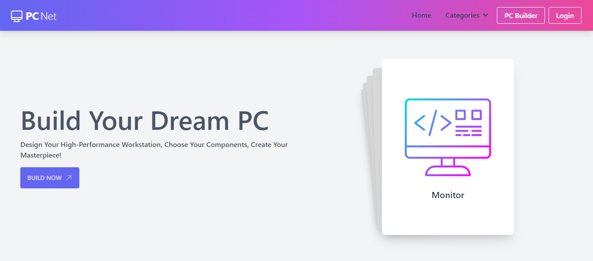

# 👋 Introducing `PC Net`

<p align="center">
    <a href="https://tryshape.vercel.app" target="blank"/>
        
    </a>
</p>

`PC Net` is a web application for assembling custom PCs with a wide selection of components

# 🚀 Use PC Net

Please access `PC Net` using the URL:

> https://pc-builder-nu-two.vercel.app/

# 🔥 Features

`PC Net` comes with a bundle of features already. You can do the followings with it,

## 🎯 Component Selection

- Users can choose from a variety of components such as CPUs, GPUs, motherboards, RAM, storage devices, and more to build their custom PC.

## 🏗️ Category Navigation

- Components are organized into categories for easy navigation, making it simple for users to find the parts they need.

## 📢 Product Details:

- Detailed information is available for each component, including product images, specifications, and user reviews.

## 💻 Complete Build

- Users can assemble a complete PC by selecting components from different categories and ensuring compatibility.

## 📌 SSG and SSR

- The application utilizes Server-Side Generation (SSG) and Server-Side Rendering (SSR) for improved performance and SEO optimization.

## 🔍 Redux State Management:

- Redux is used for state management, providing a smooth and consistent user experience.

## 🎿 User-Friendly Interface:

- An intuitive and user-friendly interface makes it easy for both beginners and experienced users to build their custom PCs.

## 🔑 Authentication & Authorization

- Implementing authentication and authorization with NextAuth.js, including social login providers such as Google and GitHub, ensures that the PC Builder page is secure and only accessible to logged-in users, enhancing the privacy and control over the user's build configurations.

## 📱 Responsive and mobile-friendly

- The application is designed to work seamlessly on both desktop and mobile devices.

# 🍔 Built With

- [Next.Js](https://nextjs.org/): The React Framework for the Web
- [Mongo DB](https://harperdb.io/https://www.mongodb.com/): A flexible Data Store
- [Node.Js](https://nodejs.org/en): Powerful Javascript runtime.
- [Express.Js](http://expressjs.com/): A easier and simple Node.Js library
- [Tailwind](https://tailwindcss.com/): A popular css framework
- [daisyUI](https://daisyui.com/): An amazing Tailwind based component library
- [Swiper](https://swiperjs.com/):The Most Modern Mobile Touch Slider
- [react-toastify](https://www.npmjs.com/package/react-toastify): Super cool toast messages
- [Vercel](http://vercel.com/): Amazing platform for hoisting

## 🌐 Getting Started

Clone This Repository

Then, run

````bash
npm install
#or
npm i

After that, run the development server:

```bash
npm run dev
````
